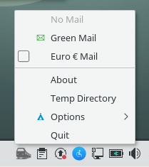
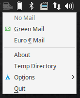
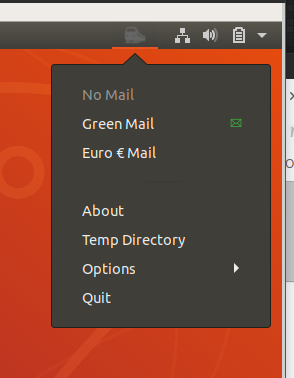
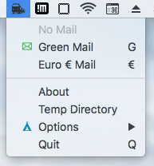
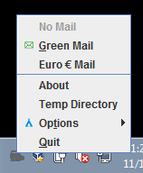
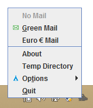
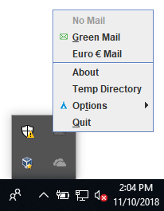
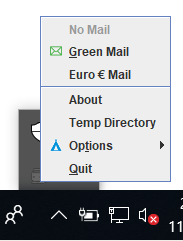
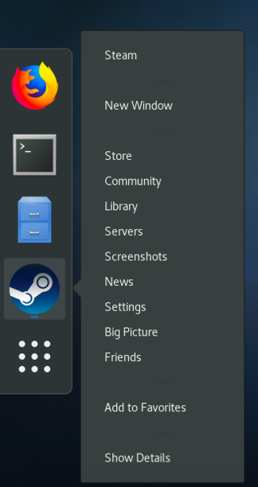

SystemTray
==========

######
[](https://git.dorkbox.com/dorkbox/SystemTray)
[](https://github.com/dorkbox/SystemTray)
[](https://gitlab.com/dorkbox/SystemTray)


Professional, cross-platform **SystemTray** support for *Swing/AWT*, *GtkStatusIcon*, and *AppIndicator* on Java 6+.  


This library provides **OS Native** menus and **Swing/AWT** menus, depending on the OS and Desktop Environment and if AutoDetect (the default) is enabled. 

 - Linux/Unix will automatically choose *Native* (*GtkStatusIcon* or *AppIndicator*) menus, Windows will choose *Native* (*WindowsNotifyIcon* with Swing menus), and MacOS will choose *AWT*.
  
 - Please note that the *Native* and *AWT* menus follow the specified look and feel of that OS and are limited by what is supported on the OS. Consequently they are not consistent across all platforms and environments.
 
 - In most cases on Linux/Unix, *Native* menus are used. In cases where libraries are missing or there are un-resolvable GTK version conflicts, we try to fallback to using *Swing*.

&nbsp;  

The following unique problems are also solved by this library:  
 1. *Sun/Oracle* system-tray icons on Linux/Unix **do not** support images with transparent backgrounds  
 1. *Sun/Oracle* system-tray and *SWT* system-tray implementations **do not** support app-indicators, which are necessary on different distributions of Linux/Unix
 1. *GNOME3* desktop environments hide or remove entirely system tray icons  (hidden from 3.16-3.25, removed from 3.26+)
 1. *Sun/Oracle* system-tray menus on Windows **look absolutely horrid**  
 1. *Sun/Oracle* system-tray icons on Windows are **hard-coded** to a max size of 24x24 (it was last updated in *2006*)  
 1. *Sun/Oracle* system-tray menus on MacOS **do not** always respond to both mouse buttons, where Apple menus do  
 1. Windows *native* menus **do not** support images attached to menu entries  
 1. Windows menus **do not** support a different L&F from the running application  
 1. Windows, Linux, and MacOSX menus (native or otherwise) do not support HiDPI configurations
 1. java.awt.Desktop.getDesktop() is **broken** when using GTK3 or on MacOS.


This is for cross-platform use, specifically - linux 32/64, mac 32/64, and windows 32/64. Java 6+

&nbsp;  
&nbsp;  

Linux
-
   

MacOS
-


Windows
-
   


&nbsp;  
&nbsp;  


Problems and Restrictions
---------
 - **JavaFX** uses *GTK2* for Java <8, and *GTK2* or *GTK3* for Java 9+. We try to autodetect this, and are mostly successful. In *some* situations where it doesn't work. Please set `SystemTray.FORCE_GTK2=true;`, or to change JavaFX (9+), use `-Djdk.gtk.version=3` to solve this.
 
 - **SWT** can use *GTK2* or *GTK3*. If you want to use *GTK2* you must force SWT into *GTK2 mode* via `System.setProperty("SWT_GTK3", "0");` before SWT is initialized and only if there are problems with the autodetection, you can also set `SystemTray.FORCE_GTK2=true;`.
 
 - **AppIndicators** under Ubuntu 16.04 (and possibly other distro's) **will not** work as a different user without extra work (ie: as a sudo'd user to `root`), since AppIndicators require a dbus connection to the current user's window manager. (see the `Notes` below for the details)
 
 - **MacOSX** is a *special snowflake* in how it handles GUI events, and so there are some bizzaro combinations of SWT, JavaFX, and Swing that do not work together. (see the `Notes` below for the details)
 
  - **MacOSX** *native* menus cannot display images attached to menu entries. If desired, one could override the default for MacOSX so that it uses *Swing* instead of *AWT*, however this will result the SystemTray no-longer supporting the OS theme and transparency. The default of *AWT* was chosen because it looks much, much better than *Swing*. 
 
 - **Gnome 3: 3.16 - 3.25** (Fedora, Manjaro, Arch, etc) environments by default **do not** allow the SystemTray icon to be shown. This has been worked around and the tray icon will be placed next to the clock. A **different** workaround is to install the [Top Icons](https://extensions.gnome.org/extension/1031/topicons/) plugin which moves icons from the *notification drawer* (it is normally collapsed) at the bottom left corner of the screen to the menu panel next to the clock.
 
 - **Gnome 3: 3.26+** (Fedora, Manjaro, Arch, etc) environments by default **do not** allow the SystemTray icon to be shown. This has been worked around and the tray icon will be placed next to the clock. A **different** workaround is to install the [Appindicator Support](https://extensions.gnome.org/extension/615/appindicator-support/) plugin which allows the addition of app-indicator icons where one would expect. Additionally, you will need to install `libappindicator-gtk3`.
  
 - **ToolTips** The maximum length is 64 characters long, and it is not supported on all Operating Systems and Desktop Environments. Specifically, Swing and GtkStatusIcon types support tray tooltips and menu tooltips. AWT and AppIndicator types do not support tooltips of any kind. Please note that **Ubuntu** uses AppIndicators!
                     
 - **Linux/Unix Menus** Some Linux environments only support right-click to display the menu, and it is not possible to change the behavior.
 
 - **Linux/Unix and java.awt.Desktop.getDesktop()** Please use the `dorkbox.util.Desktop` class as a replacement, which will intelligently
  call the correct OS API to open a folder/directory, email, or browser. (*Many thanks to QZ Tray for this*).

- **WSL** Windows Subsystem for Linux requires some [extra work](https://github.com/dorkbox/SystemTray/issues/88) to get a tray icon showing correctly, either by starting java under windows (instead of WSL), or by adding an X-Server.
 

AutoDetect Compatibility List
------------------
     
OS | Supported 
--- | --- |
Arch Linux + Gnome3 | ✓ |
 | |
ChromeOS | x |
 | |
Debian 8.5 + Gnome3 | ✓ |
Debian 8.6 + Gnome3 | ✓ |
 | |
Debian 9.5 + Gnome3 | ✓ |
Debian 9.5 + KDE | ✓ |
Debian 9.5 + Cinnamon | ✓ |
Debian 9.5 + MATE | ✓ |
Debian 9.5 + LXDE | ✓ |
Debian 9.5 + XFCE | ✓ |
 | |
Elementary OS 0.3.2 | ✓ |
Elementary OS 0.4 | ✓ |
Elementary OS 5.0 | * |
 | |
Fedora 23 | ✓ |
Fedora 24 | ✓ |
Fedora 25 | ✓ |
Fedora 25 KDE | ✓ |
Fedora 26 | ✓ |
Fedora 27 | ✓ |
Fedora 28 | ✓ |
Fedora 29 | ✓ |
 | |
FreeBSD 11 + Gnome3 | ✓ |
 | |
Kali 2016 | ✓ |
Kali 2017 | ✓ |
 | |
LinuxMint 18 | ✓ |
 | |
Ubuntu 12.04 | ✓ |
Ubuntu 14.04 | ✓ |
Ubuntu 16.04 | ✓ |
Ubuntu 17.04 | ✓ |
Ubuntu 17.10 | ✓ |
Ubuntu 18.04 | ✓ |
 | |
UbuntuGnome 16.04 | ✓ |
UbuntuGnome 17.04 | ✓ |
 | |
XUbuntu 16.04 | ✓ |
 | |
MacOSx      | ✓ |
 | |
Windows XP  | ✓ |
Windows 7   | ✓ |
Windows 8.1 | ✓ |
Windows 10  | ✓ |

Notes:
-------
 - If you have us working on an *unlisted* OS/DE, please let us know!!
 
 - The compatibility list only applies while the SystemTray is in `AutoDetect` mode. Not all OSes support forcing a custom tray type.
 
 - Some Linux operating systems with `GNOME 3` might require the installation of the app-indicator library as well. We provide feedback when
    this is necessary. (Arch, Fedora, etc)
 
 - The menu item callbacks occur on **their own dispatch thread** (instead of being on whatever OS's event dispatch thread), in order to 
    provide consistent actions across all platforms. It is critical to make sure that access to Swing/etc that depend on running events
    inside their own `EDT`, are properly called. IE: `SwingUtilities.invokeLater()`. Do not use `invokeAndWait()` as weird GUI anomalies 
    can happen.
 
 - `Ubuntu 16.04+` with `JavaFX` require `libappindicator1` because of JavaFX GTK and indicator panel incompatibilities. See [more details](https://github.com/dorkbox/SystemTray/issues/14#issuecomment-248853532). We attempt to fallback to using Swing in this situation.  

 - `Ubuntu 17.04`, Java only supports the `X11` backend. `MIR` is not supported.

 - `Debian` + `GNOME 3`, SystemTray works, but will only show in a tray via pressing SUPER+M.  

 - `MacOSX JavaFX` (Java7) is incompatible with the SystemTray by default. See [issue details](https://bugs.openjdk.java.net/browse/JDK-8116017).
     - To fix this do one of the following
        - Upgrade to Java 8
        - Add : `-Djavafx.macosx.embedded=true` as a JVM parameter
        - Set the system property via `System.setProperty("javafx.macosx.embedded", "true");`  before JavaFX is initialized, used, or accessed. *NOTE*: You may need to change the class (that your main method is in) so it does NOT extend the JavaFX `Application` class.

  - `SWT` builds for `FreeBSD` do not exist.
  
  - `ElementaryOS 5.0+` removed support for appindicators by just not including a library. [You can add it back with here.](https://git.dorkbox.com/dorkbox/elementary-indicators)
  
  - Linux/Unix: If you want to run this library as a different user, you will need to launch your application via `sudo su username /bin/sh -c "DBUS_SESSION_BUS_ADDRESS='unix:abstract=/tmp/dbus-cLtEoBPmgC' XDG_CURRENT_DESKTOP=$XDG_CURRENT_DESKTOP program-name"`, where `unix:abstract=/tmp/dbus-cLtEoBPmgC` from `/run/user/{uid}/dbus-session`. You will also want to disable the root check + warnings via `SystemTray.ENABLE_ROOT_CHECK=false;` See [issue](https://github.com/dorkbox/SystemTray/issues/63) for more details.
  
  - Linux/Unix: If you want to create a custom menu for the LAUNCHER icon, you must create a custom `.desktop` shortcut in order to create `Actions`. Credit to [@tresf ](https://github.com/dorkbox/SystemTray/issues/71#issuecomment-378345423) for figuring this out.
  
       For example:
   
    
      
  ```ini
  [Desktop Entry]
  Name=Steam
  Comment=Application for managing and playing games on Steam
  Exec=/usr/bin/steam %U
  Icon=steam
  Terminal=false
  Type=Application
  Categories=Network;FileTransfer;Game;
  MimeType=x-scheme-handler/steam;
  Actions=Store;Community;Library;Servers;Screenshots;News;Settings;BigPicture;Friends;
  ```
  
  And then the executable path and language translations are as follows:
  ```ini
  [Desktop Action Store]
  Name=Store
  Name[de]=Shop
  Name[es]=Tienda
  Name[fr]=Magasin
  Name[it]=Negozio
  Name[pt]=Loja
  Name[ru]=Магазин
  Name[zh_CN]=商店
  Name[zh_TW]=商店
  Exec=steam steam://store
  ```
  
&nbsp;  
&nbsp;  

```
Customization parameters:

SystemTray.AUTO_SIZE   (type boolean, default value 'true')
 - Enables auto-detection for the system tray. This should be mostly successful.
 
 
SystemTray.APP_NAME   (type String, default value 'SystemTray')
 - Default name of the application, sometimes shows on tray-icon mouse over. Not used for all OSes, but mostly for Linux */
   
 
SystemTray.FORCE_GTK2    (type boolean, default value 'false')
 - Forces the system tray to always choose GTK2 (even when GTK3 might be available).
 
 
SystemTray.PREFER_GTK3    (type boolean, default value 'true') 
 - Prefer to load GTK3 before trying to load GTK2.
    

SystemTray.FORCE_TRAY_TYPE   (type SystemTray.TrayType, default value 'AutoDetect')
 - Forces the system tray detection to be AutoDetect, GtkStatusIcon, AppIndicator, WindowsNotifyIcon, Swing, or AWT.
   This is an advanced feature, and it is recommended to leave it at AutoDetect.

 
SystemTray.ENABLE_SHUTDOWN_HOOK    (type boolean, default value 'true')
 -  When in compatibility mode, and the JavaFX/SWT primary windows are closed, we want to make sure that the SystemTray is also 
    closed.  Additionally, when using the Swing tray type, Windows does not always remove the tray icon if the JVM is stopped, 
    and this makes sure that the tray is also removed from the notification area. 
    This property is available to disable this functionality in situations where you do not want this to happen.
    This is an advanced feature, and it is recommended to leave as true.
 
 
SystemTray.AUTO_FIX_INCONSISTENCIES    (type boolean, default value 'true')
 -  Allows the SystemTray logic to resolve various OS inconsistencies for the SystemTray in different combinations

 
SystemTray.ENABLE_ROOT_CHECK    (type boolean, default value 'true')
 -  Allows the SystemTray logic to ignore if root is detected. Usually when running as root it will not work (because of 
    how DBUS operates), but in rare situations, it might work.
    This is an advanced feature, and it is recommended to leave as true 
 
 
SystemTray.SWING_UI    (type SwingUIFactory, default value 'null')
 - Allows the developer to provide a custom look and feel for the Swing UI, if defined. See the test example for specific use.
      
 
SystemTray.DEBUG    (type boolean, default value 'false')
 -  This property is provided for debugging any errors in the logic used to determine the system-tray type and initialization feedback.
```
   
   
   
The test application is [on Git](https://git.dorkbox.com/dorkbox/SystemTray/src/branch/master/test/dorkbox/TestTray.java), and a *simple* example is as follows:
```
    SystemTray.SWING_UI = new CustomSwingUI();

    SystemTray systemTray = SystemTray.get();
    if (systemTray == null) {
        throw new RuntimeException("Unable to load SystemTray!");
    }
 
    try {
        systemTray.setImage("grey_icon.png");
    } catch (IOException e) {
        e.printStackTrace();
    }
 
    systemTray.setStatus("Not Running");
    
    
    systemTray.getMenu().add(new MenuItem("Quit", new ActionListener() {
        @Override
        public
        void actionPerformed(final ActionEvent e) {
            systemTray.shutdown();
            //System.exit(0);  not necessary if all non-daemon threads have stopped.
        }
    })).setShortcut('q'); // case does not matter
```
&nbsp;  
&nbsp;  

``` 
Note: This project was heavily influenced by the excellent Lantern project (when it was Java based),
      *Many* thanks to them for figuring out AppIndicators via JNA.
      https://github.com/getlantern/lantern
```
```
Note: Gnome-shell users can install an extension to support placing the tray icon next to all 
      of other OS tray icons. By default, all tray icons go to a "Notification drawer" which 
      is initially hidden. 
````
````
Note: We have fixed the Swing notification tray on Linux (it no longer has a greyish background), however
      to facilitate this, a screen-shot is grabbed where the icon is. Because this must happen after the
      icon is placed, *sometimes* you can see this happen. Unfortunately this is the only way to fix
      this problem, and there are no other known workarounds outside of writing an X11 wrapper from scratch.
````
&nbsp;  
&nbsp;  
````      
ISSUES:
      'Trying to remove a child that doesn't believe we're it's parent.'
      
      This is a known appindicator bug, and is rather old. Some distributions use 
      an OLD version of libappindicator, and will see this error. 
         See: https://github.com/ValveSoftware/steam-for-linux/issues/1077
         
         
      'gsignal.c: signal 'child-added' is invalid for instance 'xyz' of type 'GtkMenu''
      This is a known appindicator bug, and is rather old. Some distributions use an 
      OLD version of libappindicator, and will see this error. 
      
      The fallout from this issue (ie: menu entries not displaying) has been 
      *worked around*, so the menus should still show correctly.
         See: https://askubuntu.com/questions/364594/has-the-appindicator-or-gtkmenu-api-changed-in-saucy
  
````
&nbsp; 
&nbsp; 

Maven Info
---------
````
<dependencies>
    ...
    <dependency>
      <groupId>com.dorkbox</groupId>
      <artifactId>SystemTray</artifactId>
      <version>3.17</version>
    </dependency>
</dependencies>
````

Gradle Info
---------
````
dependencies {
    ...
    compile 'com.dorkbox:SystemTray:3.17'
}
````

Or if you don't want to use Maven, you can access the latest files and source-code directly from here:  
https://git.dorkbox.com/dorkbox/SystemTray/releases  

https://repo1.maven.org/maven2/com/dorkbox/SystemTray/  
https://repo1.maven.org/maven2/com/dorkbox/ShellExecutor/    


https://repo1.maven.org/maven2/net/java/dev/jna/jna/  
https://repo1.maven.org/maven2/net/java/dev/jna/jna-platform/  
https://repo1.maven.org/maven2/org/slf4j/slf4j-api/  
https://repo1.maven.org/maven2/org/javassist/javassist/  


License
---------
This project is © 2014 dorkbox llc, and is distributed under the terms of the Apache v2.0 License. See file "LICENSE" for further references.

